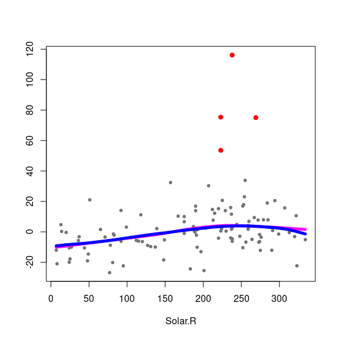

Robust backfitting
================
Matias Salibian
2020-07-02

## A robust backfitting algorithm

The `R` package `RBF` (available on CRAN
[here](https://cran.r-project.org/package=RBF)) implements the robust
back-fitting algorithm as proposed by Boente, Martinez and
Salibian-Barrera in

> Boente G, Martinez A, Salibian-Barrera M. (2017) Robust estimators for
> additive models using backfitting. Journal of Nonparametric
> Statistics. Taylor & Francis; 29, 744-767.
> [DOI: 10.1080/10485252.2017.1369077](https://doi.org/10.1080/10485252.2017.1369077)

This repository contains a development version of `RBF` which may differ
slightly from the one available on CRAN (until the CRAN version is
updated appropriately).

The package in this repository can be installed from within `R` by using
the following code (assuming the
[devtools](https://cran.r-project.org/package=devtools)) package is
available:

``` r
devtools::install_github("msalibian/RBF")
```

### An example

Here is a (longish) example on how `RBF` works. We use the Air Quality
data.

``` r
library(RBF)
data(airquality)
```

A scatter plot of the data

``` r
pairs(airquality[, c('Ozone', 'Solar.R', 'Wind', 'Temp')], 
      pch=19, col='gray30', cex=1.5)
```

<!-- -->

The following bandwidths were obtained via a robust leave-one-out
cross-validation procedure (described in the paper). Here we just set
them to their optimal values:

``` r
bandw <- c(136.728453,   8.894283,   4.764985)
```

Now we use the robust backfitting algorithm to fit an additive model
using Tukey’s bisquare loss (the default tuning constant for this loss
function is 4.685). We remove cases with missing entries.

``` r
ccs <- complete.cases(airquality)
fit.full <- backf.rob(Ozone ~ Solar.R + Wind + Temp, data=airquality,
                subset=ccs, windows=bandw, degree=1, type='Tukey')
```

We display the 3 fits (one per additive component), being careful with
the axis limits

``` r
lim.cl <- lim.rob <- matrix(0, 2, 3)
par(mfrow=c(2,2))
x0 <- fit.full$Xp
for(j in 1:3) {
  re <- fit.full$y - fit.full$alpha - rowSums(fit.full$g.matrix[,-j])
  lim.rob[,j] <- c(min(re), max(re))
  plot(re ~ x0[,j], type='p', pch=19, col='gray30', 
       xlab=colnames(x0)[j], ylab='', cex=1.5)
  oo <- order(x0[,j])
  lines(x0[oo,j], fit.full$g.matrix[oo,j], lwd=5, col='blue')
}
```

<!-- -->

We now compute and display the classical backfitting fits, with
bandwidths chosen via leave-one-out CV

``` r
bandw.cl <- c(91.15, 10.67, 9.53)
fit.cl <- backf.cl(Ozone ~ Solar.R + Wind + Temp, data=airquality,
                subset=ccs, windows=bandw.cl, epsilon=1e-6, 
                degree=1)
par(mfrow=c(2,2))
x0 <- fit.cl$Xp
for(j in 1:3) {
  re <- fit.cl$y - fit.cl$alpha - rowSums(fit.cl$g.matrix[,-j])
  lim.cl[,j] <- c(min(re), max(re))
  plot(re ~ x0[,j], type='p', pch=19, col='gray30', 
       xlab=colnames(x0)[j], ylab='', cex=1.5)
  oo <- order(x0[,j])
  lines(x0[oo,j], fit.cl$g.matrix[oo,j], lwd=5, col='magenta')
}
```

<!-- -->

The following plots are partial residual plots with both the classical
and robust fits on them

``` r
lims <- lim.cl
for(j in 1:3) {
  lims[1,j] <- min(lim.cl[1,j], lim.rob[1,j])
  lims[2,j] <- max(lim.cl[2,j], lim.rob[2,j])
}
par(mfrow=c(2,2))
for(j in 1:3) {
  re <- fit.cl$y - fit.cl$alpha - rowSums(fit.cl$g.matrix[,-j])
  plot(re ~ x0[,j], type='p', pch=19, col='gray30', 
       xlab=colnames(x0)[j], ylab='', cex=1.5, ylim=lims[,j])
  oo <- order(x0[,j])
  lines(x0[oo,j], fit.cl$g.matrix[oo,j], lwd=5, col='magenta')
  lines(x0[oo,j], fit.full$g.matrix[oo,j], lwd=5, col='blue')
}
```

<!-- -->

We look at the residuals from the robust fit to identify potential
outiers

``` r
re.ro <- fit.full$y - fit.full$alpha - rowSums(fit.full$g.matrix)
ou.ro <- boxplot(re.ro, plot=FALSE)$out
n <- length(re.ro)
ou.ro <- (1:n)[ re.ro %in% ou.ro ]
boxplot(re.ro, col='gray80', pch=19, cex=1.5)
points(rep(1, length(ou.ro)), re.ro[ou.ro], pch=19, cex=2, col='red')
```

<!-- -->

We highlight these suspicious observations on the scatter plot

``` r
aircomplete <- airquality[ccs, ]
cs <- rep('gray30', nrow(aircomplete))
cs[ou.ro] <- 'red'
os <- 1:nrow(aircomplete)
os2 <- c(os[-ou.ro], os[ou.ro])
pairs(aircomplete[os2, c('Ozone', 'Solar.R', 'Wind', 'Temp')], 
      pch=19, col=cs[os2], cex=1.5)
```

<!-- -->

and on the partial residuals plots

``` r
par(mfrow=c(2,2))
for(j in 1:3) {
  re <- fit.full$y - fit.full$alpha - rowSums(fit.full$g.matrix[,-j])
  plot(re ~ x0[,j], type='p', pch=19, col='gray30', 
       xlab=colnames(x0)[j], ylab='', cex=1.5, ylim=lims[,j])
  points(re[ou.ro] ~ x0[ou.ro,j], pch=19, col='red', cex=1.5)
  oo <- order(x0[,j])
  lines(x0[oo,j], fit.cl$g.matrix[oo,j], lwd=5, col='magenta')
  lines(x0[oo,j], fit.full$g.matrix[oo,j], lwd=5, col='blue')
}
```

<!-- -->

If we use the classical backfitting algorithm on the data without the
potential outliers, we obtain almost identical results:

``` r
# Run the classical backfitting algorithm without outliers
airclean <- aircomplete[-ou.ro, ]
bandw.cl2 <- c(138.87, 10.52, 4.85)
fit.cl2 <- backf.cl(Ozone ~ Solar.R + Wind + Temp, data=airclean,
                   windows=bandw.cl2, epsilon=1e-6, degree=1)
x02 <- fit.cl2$Xp
par(mfrow=c(2,2))
for(j in 1:3) {
  re <- fit.full$y - fit.full$alpha - rowSums(fit.full$g.matrix[,-j])
  plot(re ~ x0[,j], type='p', pch=19, col='gray30', 
       xlab=colnames(x0)[j], ylab='', cex=1.5, ylim=lims[,j])
  points(re[ou.ro] ~ x0[ou.ro,j], pch=19, col='red', cex=1.5)
  oo <- order(x02[,j])
  lines(x02[oo,j], fit.cl2$g.matrix[oo,j], lwd=5, col='magenta')
  oo <- order(x0[,j])
  lines(x0[oo,j], fit.full$g.matrix[oo,j], lwd=5, col='blue')
}
```

<!-- -->
