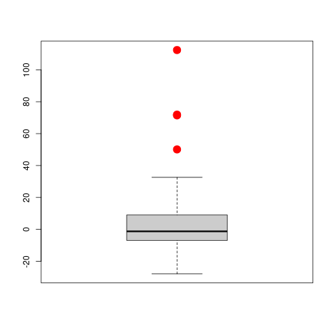

  
# Summary

Although highly flexible, non-parametric regression models typically require
large sample sizes to be estimated reliably, particularly when they include
many explanatory variables. Additive models provide an alternative that is
more flexible than linear models, not affected by the curse of
dimensionality, and also allow the exploration of individual covariate
effects. Standard algorithms to fit these models can be highly susceptible to
the presence of a few atypical or outlying observations in the data.
The ``RBF`` [@RBF] package for R implements the robust estimator for additive
models of @BoenteMartinezSalibian2017, which can resist the damaging effect
of outliers in the training set.

# Statement of Need

The purpose of ``RBF`` is to provide a user-friendly implementation of a
robust kernel-based estimation procedure for additive models that is resistant to
the presence of potential outliers. 

# Implementation Goals

``RBF`` implements a user interface similar to that of the R package ``gam``
[@gam], which computes the standard non-robust kernel-based fit for additive
models using the backfitting algorithm. The ``RBF`` package also includes
several modeling tools, including functions to produce diagnostic plots,
obtain fitted values and compute predictions.

# Background

<!-- Nonparametric regression models provide an alternative to parametric regression models such as linear regression models that require fewer and weaker assumptions  for the corresponding analysis to be correct.  In what follows we will assume that 
$(\textbf{X}_i^\top,Y_i)^\top$, $1\leq i\leq n$, are independent and identically
distributed random vectors with the same distribution as $(\textbf{X}^\top,Y)^\top$,
$\textbf{X}\in\mathbb{R}^d$, $Y\in\mathbb{R}$, satisfying the following nonparametric
regression model:
$$
Y \ = \ g(\textbf{X}) \, + \, \epsilon \, ,
$$
where the error $\epsilon$ is independent from $\textbf{X}$ and
$g:\mathbb{R}^d\to\mathbb{R}$ is the unknown regression function to be estimated. Without additional assumptions, fitting this model requires multivariate smoothing
techniques, which suffer from what is known in the literature as the *curse of dimensionality* [@Stone1985]. Intuitively, the problem is that
as the number of explanatory variables $d$ increases, neighbourhoods of a point
$\textbf{x} \in \mathbb{R}^d$ became more sparse.  This results in slower rates of
convergence for the regression function estimator.  For example, kernel-based estimators
have a convergence rate of $\sqrt{n \, h_n^d}$, where $h_n \to 0$ is the bandwidth or
smoothing parameter used for obtaining the estimator.  
-->

Additve models offer a non-parametric generalization of linear models
(@HastieTibshirani1990). They are flexible, interpretable and avoid the
*curse of dimensionality* which means that, as the number of explanatory
variables increases, neighbourhoods rapidly become sparse, and much fewer
training observations are available to estimate the regression function at
any one point.

If $Y$ denotes the response variable, and $\textbf{X} = (X_1, \ldots, X_d)^\top$ 
a vector of explanatory variables, then an additive regression model
postulates that
\begin{equation} \label{eq:model} 
Y \ = \ \mu + \sum_{j=1}^d g_j(X_j) \, + \, \epsilon \, ,
\end{equation}
where the error $\epsilon$ is independent of $\textbf{X}$ and centered at
zero, the location parameter $\mu \in \mathbb{R}$, and $g_j \, : \, \mathbb{R}
\to \mathbb{R}$ are smooth functions. Note that if $g_j( X_j ) = \beta_j \,
X_j$ for some $\beta_j \in \mathbb{R}$ then \autoref{eq:model} reduces to a
standard linear regression model.
<!-- The functions $g_j$ can be interpreted as the marginal effect
of the $j$-th covariate on the expected value of the response when all
other explanatory variables remain fixed.-->

The backfitting algorithm (@FriedmanStuetzle1981) can be used to fit the
model in \autoref{eq:model} with kernel regression estimators for the smooth
components $g_j$. It is based on the following observation: under
\autoref{eq:model} the additive components satisfy $g_j(x) = E [ Y - \mu -
\sum_{\ell \ne j} g_\ell(X_\ell) | X_j = x ]$. Thus, each $g_j$ is iteratively
computed by smoothing the partial residuals as functions of $X_j$.

It is well known that these estimators can be seriously affected by a relatively small 
proportion of atypical observations in the training set.
@BoenteMartinezSalibian2017 proposed a robust version of backfitting, which
is implemented in the ``RBF`` package. Intuitively, the idea is to use the
backfitting algorithm with robust smoothers, such as kernel-based M-estimators
(@BoenteFraiman1989). 
<!--This approach corresponds to iteratively compute estimators of the additive functions satisfying the system of equations given by $E \left[\left. \rho\left(\frac{Y - \mu - \sum_{\ell \ne j} g_\ell(X_\ell)-g_j(x)}{\sigma}\right) \right| X_j = x \right]$
-->
These robust estimators solve:
<!--\begin{equation} \label{rbf:min}
\min_{\mu, g_1, \ldots, g_d} E \left[ \, \rho \left( \frac{Y - \mu -
\sum_{j=1}^d g_j(X_j) }{\sigma} \right) \right] 
\end{equation}
-->
$$ \min_{\mu, g_1, \ldots, g_d} E \left[ \, \rho \left( \frac{Y - \mu -
\sum_{j=1}^d g_j(X_j) }{\sigma} \right) \right]  \, , 
$$
where the minimization is computed 
over $\mu \in \mathbb{R}$, and functions $g_j$ with $E[g_j(X_j)] = 0$ and
$E[g_j^2(X_j)] < \infty$. The loss function 
$\rho : \mathbb{R} \to \mathbb{R}$ is even,
non-decreasing and non-negative, and $\sigma$ is the residual
scale. Different choices of the loss function $\rho$ yield fits with
varying robustness properties. 
Typical choices for $\rho$ are Tukey's bisquare family
and Huber's loss (@maronna2018robust).  Note that when $\rho(t) =
t^2$, this approach reduces to the standard backfitting.  

# Illustration

The ``airquality`` data set contains 153 daily air quality measurements in
the New York region between May and September, 1973
(@ChambersClevelandKleinerTukey1983). The interest is in modeling the mean
Ozone (\lq\lq $\mbox{O}_3$\rq\rq) concentration as a function of 3 potential
explanatory variables: solar radiance in the frequency band
4000-7700 (\lq\lq Solar.R\rq\rq), wind speed (\lq\lq Wind\rq\rq) and
temperature (\lq\lq Temp\rq\rq). We focus on the 111 complete entries in the
data set.

Since the plot in \autoref{fig:scatterplot} suggests that the
relationship between ozone and the other variables is not linear, we propose
using an additive regression model of the form
\begin{equation} \label{eq:ozone-model}
\mbox{Ozone}=\mu+g_{1}(\mbox{Solar.R})+g_{2}(\mbox{Wind})+g_{3}(\mbox{Temp}) + \varepsilon \, .
\end{equation} 

{ width=85% }

<!-- 
{ width=50% } -->

<!--Based on the results of the simulation study reported in
@BoenteMartinezSalibian2017, w-->
To fit the model above we use robust local linear kernel M-estimators and
Tukey's bisquare loss function. These choices are set using the
arguments ``degree = 1`` and ``type='Tukey'`` in the call to the function ``backf.rob``. 
<!-- $\rho$ function we use its default value ``k.t = 4.685``, which corresponds
to a linear regression estimator with 95\% efficiency when errors are Gaussian.
This choice provides a good balance between robustness and efficiency. -->
The model is specified with the standard formula notation in R. The argument
``windows`` is a vector with the bandwidths to be used with each kernel
smoother. To estimate optimal values we used a robust leave-one-out cross
alidation approach (@BoenteMartinezSalibian2017) which resulted in the
following bandwidths:

<!--
To select the bandwidths of the smoothers (in the vector ``bandw`` above) we consider
a 3 dimensional grid, where the possible bandwidths for each variable are:
$\hat{\sigma}_j / 2$,  $\hat{\sigma}_j$, $1.5 \, \hat{\sigma}_j$, $2 \hat{\sigma}_j$,
$2.5 \, \hat{\sigma}_j$ and $3 \, \hat{\sigma}_j$, and $\hat{\sigma}_j$ is the
standard deviation of the $j$-th explanatory variable.
This corresponds to a search over 216 possible combinations of bandwidths.  For
each of these vectors of 3 bandwidths we used 
leave-one-out combined with the robust cross-validation criterion in
(\autoref{eq:robustcv}).

We obtained the following optimal triplet:-->
```
R> bandw <- c(136.7285, 10.67314, 4.764985)
```

The code below computes the corresponding robust backfitting estimator 
for \autoref{eq:ozone-model}:

```
R> data(airquality)
R> library(RBF)
R> ccs <- complete.cases(airquality)
R> fit.full <- backf.rob(Ozone ~ Solar.R + Wind + Temp, windows=bandw, 
                   degree=1, type='Tukey', subset = ccs, data=airquality)
```
<!-- Convergence of the iterative backfitting algorithm is controlled using the
arguments ``epsilon`` (maximum acceptable relative absolute difference
between consecutive estimates $\hat{g}_j$) and \code{max.it} (maximum number of
iterations). 
-->

To compare the robust and classical estimators we use the R package ``gam``. 
Optimal bandwidths were estimated using leave-one-out
cross-validation as before.
```
R> library(gam)
R> aircomplete <- airquality[ccs, c('Ozone', 'Solar.R', 'Wind', 'Temp')]
R> fit.gam <- gam(Ozone ~ lo(Solar.R, span=.7) + lo(Wind, span=.7) + 
                  lo(Temp, span=.5), data=aircomplete)
```
\autoref{fig:ozonetodos} contains partial residuals plots and both sets of estimated functions: 
blue solid lines indicate the robust fit and magenta dashed ones the classical one.

{ width=85% } 

The two fits differ mainly on the estimated effects of wind speed and
temperature. The classical estimate for $g_1(\mbox{Temp})$ is consistently
lower than the robust counterpart for $\mbox{Temp} \ge 85$. For wind speed,
the non-robust estimate $\hat{g}_2(\mbox{Wind})$ suggests a higher effect
over Ozone concentrations for low wind speeds than the one given by the
robust estimate, and the opposite difference for higher speeds.

<!-- To visualize the estimated smooth components,
we generate plots of partial residuals using the ``plot`` method and obtained the following estimated curves:  The
argument ``which`` specifies the desired component to be displayed.  For
example, to obtain the plot of the partial residuals associated with the first
additive component $g_1$, we use
```
R> plot(fit.full, which=1)
```
Similarly, the other partial residual
plots can be obtained setting the argument ``which`` to the indices of the desired components (e.g. 
``which = c(1, 3)``). By default all partial residual plots are displayed. 
-->
<!-- Figure \autoref{fig:ozone-full} shows the plots of the three partial residuals and the
corresponding estimated additive components of the model. 
-->
<!--

-->

Residuals from a robust fit can generally be used to detect the presence of
atypical observations in the training data. \autoref{fig:boxplot}
displays a boxplot of these residuals. We note 4 possible outlying points
(indicated with red circles).

<!-- In addition to displaying the boxplot, we use the function
``boxplot`` to also identify outlying residuals as shown in the code below.
Residuals and fitted values over the sample can be extracted from the fit
object using the methods ``predict`` and ``residuals``.  The code below
was used to generate Figure \autoref{fig:ozone-boxplot} that shows the resulting
boxplot with 4 observations detected as outliers highlighted in red. These
correspond to observations 23, 34, 53 and 77.
-->
<!--
```
R> re.ro <- residuals(fit.full)
R> ou.ro <- boxplot(re.ro, col='gray80')$out
R> in.ro <- (1:length(re.ro))[ re.ro %in% ou.ro ]
R> points(rep(1, length(in.ro)), re.ro[in.ro], pch=20, cex=1.5, col='red')
```
-->

{ width=50% }


<!-- In Figure \autoref{fig:ozone-scat-h} we use red points to identify the 
potential outliers in the scatter plot of the data.  Note that not all these
suspected atypical observations are particularly extreme, or directly evident
on the scatter plot. However, as we show below, they do have an important
effect on the estimates of the components of the additive model. 


-->

<!-- We ran a similar leave-one-out
cross-validation experiment to select the spans for each the 3 univariate
smoothers. Mimicking the bandwidth search done for the robust backfitting
estimator, we considered 7 possible span values for each explanatory variable:
0.3, 0.4, 0.5, \ldots, 0.9. Using the optimal values we compute the
non-robust fit with the following lines:
-->

<!--
<center>  
 
 
</center>
-->

<!--
\begin{figure}[t]
\begin{center}
\subfigure[Robust and classical $\hat{g}_1$]{\includegraphics[width=0.3\textwidth]{Figure-ozone-res-h-g3.pdf}}
\subfigure[Robust and classical $\hat{g}_2$]{\includegraphics[width=0.3\textwidth]{Figure-ozone-res-h-g2.pdf}}
\subfigure[Robust and classical $\hat{g}_3$]{\includegraphics[width=0.3\textwidth]{Figure-ozone-res-h-g1.pdf}}
\end{center}
\vskip-0.2in 
\caption{\label{fig:ozone-res-h}{Plots of partial residuals with the robust backfitting fit, the estimated curves with the classical (in magenta) and robust (in blue) procedures. The potential outliers are highlighted in red.
\end{figure}
-->

To investigate whether the differences between the robust and non-robust estimators 
are due to the outliers, we recomputed the classical fit after removing them.
\autoref{fig:ozoneout} shows the estimated curves obtained with the classical estimator 
using the \lq\lq clean\rq\rq\ data together with the robust ones (computed on the whole data set). 
Outliers are highlighted in red. Note that both fits are now very close. 
An intuitive interpretation is that the robust fit has automatically down-weighted potential outliers 
and produced estimates very similar to the classical ones applied to the \lq\lq  clean\rq\rq\ observations.

{ width=85% }

<!--
<center>  
 
 
</center>
-->

<!--
\begin{figure}[t]
\begin{center}
\subfigure[Robust and classical $\hat{g}_1$]{\includegraphics[width=0.3\textwidth]{Figure-ozone-out-cla-rob-g3.pdf}}
\subfigure[Robust and classical $\hat{g}_2$]{\includegraphics[width=0.3\textwidth]{Figure-ozone-out-cla-rob-g2.pdf}}
\subfigure[Robust and classical $\hat{g}_3$]{\includegraphics[width=0.3\textwidth]{Figure-ozone-out-cla-rob-g1.pdf}}
\end{center}
\vskip-0.2in 
\caption{\label{fig:ozone-out}{Plots of estimated curves and partial residuals with the robust backfitting fit. In magenta, the estimated curves with the classical backfitting procedure without 
	potential outliers, and in blue the estimated curves with the robust approach. 
Red points correspond to the potential outliers. 
}}
\end{figure}
-->

# Availability

The software is available at the Comprehensive R Archive Network [CRAN](https://CRAN.R-project.org/) 
and also at the  GitHub repository
[https://github.com/msalibian/RBF](https://github.com/msalibian/RBF). The GitHub repository also 
contains detailed scripts reproducing the data analysis above.

# Acknowledgements

This research was partially supported by: 20020170100022BA from the
Universidad de Buenos Aires; project PICT 2018-00740 from ANPCYT; Internal
Projects CD-CBLUJ 301/19 and CD-CBLUJ 204/19 from the Department of Basic
Science of the Universidad Nacional de Luj&aacute;n (UNLu); the Researchers in
Training Project RESREC-LUJ 224/19 (UNLu); and by the Natural Sciences and
Engineering Research Council of Canada (Discovery Grant RGPIN-2016-04288).

# References
