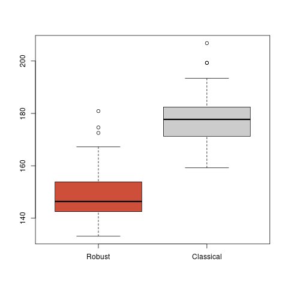
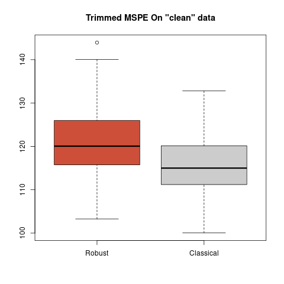
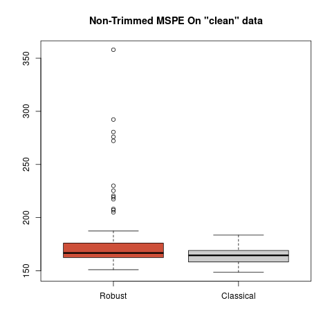

```{r setup, include=FALSE}
knitr::opts_chunk$set(
  collapse = TRUE,
  comment = "#>"
)
```
## About this vignette

In this vignette we illustrate the use and properties of the
robust backfitting estimator for additive models proposed in 

> Boente G, Martinez A, Salibian-Barrera M. (2017) Robust estimators for additive models using backfitting. Journal of Nonparametric Statistics. Taylor & Francis; 29, 744-767. [DOI: 10.1080/10485252.2017.1369077](https://doi.org/10.1080/10485252.2017.1369077)


<!-- The `R` package `RBF` (available on CRAN [here](https://cran.r-project.org/package=RBF))  -->
<!-- implements the robust back-fitting algorithm as proposed by -->
<!-- Boente, Martinez and Salibian-Barrera  in  -->

<!-- This repository contains a development version of `RBF` -->
<!-- which may differ slightly from the one available on CRAN -->
<!-- (until the CRAN version is updated appropriately).  -->

<!-- The package in this repository can be installed from within `R` by using the following code (assuming the [devtools](https://cran.r-project.org/package=devtools)) package is available: -->
<!-- ```R -->
<!-- devtools::install_github("msalibian/RBF") -->
<!-- ``` -->
<!-- and charged in the `R` session by the following command -->
<!-- ```{r library} -->
<!-- library("RBF") -->
<!-- ``` -->
<!-- Now that the `R` package is downloaded, we can now start to see how this procedure works. -->

### Boston example

We will use the well-known `Boston` house price data of Harrinson and Rubinfeld (1978). This dataset was used as an example to model an additive model by Härdle et a. (2004). The data are available in the `MASS` package. It contains $n=506$ observations and 14 variables measured on the census districts of the Boston metropolitan area. Following the analysis in Härdle et a. (2004) we use the following 10 explanatory variables:

- `crim`: per capita crime rate by town ($X_1$),
- `indus`: proportion of non-retail business acres per town ($X_2$),
- `nox`: nitric oxides concentration (parts per 10 million) ($X_3$),
- `rm`: average number of rooms per dwelling ($X_4$),
- `age`: proportion of owner-occupied units built prior to 1940 ($X_5$),
- `dis`: weighted distances to five Boston employment centers ($X_6$),
- `tax`: full-value property tax rate per 10,000 ($X_7$),
- `ptratio`: pupil-teacher ratio by town ($X_8$),
- `black`: $1,000(Bk-0.63)^2$ where $Bk$ is the proportion of people of Afrom American descent by town ($X_9$),
- `lstat`: percent lower status of population ($X_{10}$),

The response variable $Y$ is `medv`, the median value of the owner-occupied homes in 1,000 USD, and the proposed  additive model is
$$Y= \mu+ \sum_{j=1}^{10} g_j(\log(X_j))+ \epsilon.$$

```{r read the dataset}
data(Boston, package='MASS')
dd <- Boston[, c(1, 3, 5:8, 10:14)]
dd[, -11] <- log( dd[, names(dd) != 'medv'] )
```

```{r loadpckg}
library(RBF)
```

The backfitting estimators for each additive component are 
computed using kernel-based local polynomial regression, and thus 
bandwidth selection is an important step. We follow 
Härdle et al. (2004) and select bandwidths $h_j$, $1 \le j \le 10$, 
proportional to the standard deviation of the corresponding
explanatory variables $X_j$, specifically we set 
$h_j = \hat{\sigma}_j / 2$: \textcolor{red}{OBS! EN REALIDAD ES EL DESVIO DEL LOGARITMO DE LAS $X_j$.}
```{r bandwidths}
bandw <- apply(dd[, names(dd) != 'medv'], 2, sd) / 2
```
To compute the robust backfitting estimator we specify the model using the
standard `formula` notation in `R`. Other necessary arguments to compute
the robust backfitting estimator are:

- `windows`: the bandwidths,
- `degree`: the degree of the  polynomial used for the kernel local regression, defaults to `0`,
- `type`: specifies the robust loss function, options are `Huber` or `Tukey`, defaults to `Huber`.

The command to compute the fit is:
```{r robust fit, cache=TRUE}
robust.fit <- backf.rob(medv ~ ., data = dd, degree = 0, type = 'Huber', 
                        windows = bandw)
```
The summary method provides information on the resulting fit: 
```{r summary}
summary(robust.fit)
```
while the plot method can be used to visualize the estimated 
additive components displayed over the corresponding partial
residuals: $$R_{ij}=Y_i-\hat{\mu}-\sum_{k\neq i}\hat{g}_k(X_{ik}).$$ 
```{r plot}
plot(robust.fit)
```

By default, `backf.rob` computes fitted values on the training
set. If predictions at a different specific point are desired, 
we can pass those points using the argumen `point`. For example, 
to obtain predicted values at the point given by average of 
each explanatory variable, we can use the following 
command (note that this step implies re-fitting the whole model):
```{r prediction, cache=TRUE}
po <- colMeans(dd[, names(dd) != 'medv'])
robust.fit1 <- backf.rob(medv ~ ., data = dd, degree = 0, type = 'Huber', 
                         windows = bandw, point = po)
```
The values of the estimated components evaluated at the 
corresponding coordinates of `po` are 
returned in the `$prediction` element: 
```{r showpred}
robust.fit1$prediction
```
In order to illustrate the behaviour of the robust fit when 
outliers are present in the data, we artifically introduce
1% of atypical values in the response variable: 
```{r outliers}
dd2 <- dd
dd2$medv[1:5]<- rep(400, 5)
```
Then, if the recalculate the robust fit, we obtain similar curves to what was obtained with the original data set.
```{r robustplotswithoutliers, cache=TRUE}
robust.fit.new <- backf.rob(medv ~ ., data = dd2, degree=0, type='Huber', windows=bandw, point = po)
summary(robust.fit.new)
robust.fit.new$prediction
plot(robust.fit.new)
```

Since the differences between the two estimations cannot be appreciated, we will plot both robust fits for all the ten covariates. In green and dashed lines the robust estimator computed with the original data set, and in blue and solid lines the robust estimator computed with the contaminated data set.

```{r robustplots2, warning=FALSE}
for(j in 1:10) {
  name.x <- names(dd)[j] 
  name.y <- bquote(paste(hat('g')[.(j)]))
  oo <- order(dd2[,j])
  plot(dd2[oo,j], robust.fit.new$g.matrix[oo,j], type="l", lwd=5, col='blue', lty=1, 
       xlab=name.x, ylab=name.y)
  lines(dd2[oo,j], robust.fit$g.matrix[oo,j], lwd=5, col='green', lty=2)
}
```

However, the classical fit doesn't behave in this way. In order to observe the difference in sensitivity of the robust fit with its classical counterpart, we will use package `gam` to estimate the additive functions under both settings: with the original dataset and with the one with the contaminated responses.

```{r gam, warning=FALSE}
library(gam)
fit.gam <- gam(medv ~ lo(crim, span=1.62) + 
                 lo(indus, span=0.58) + 
                 lo(nox, span=0.15) + 
                 lo(rm, span=0.08) +
                 lo(age, span=0.46) + 
                 lo(dis, span=0.40) + 
                 lo(tax, span=0.30) + 
                 lo(ptratio, span=0.09) +
                 lo(black, span=0.58) + 
                 lo(lstat, span=0.45), data=dd)
fits <- predict(fit.gam, type='terms')
fit.gam.new <- gam(medv ~ lo(crim, span=1.62) + 
                 lo(indus, span=0.58) + 
                 lo(nox, span=0.15) + 
                 lo(rm, span=0.08) +
                 lo(age, span=0.46) + 
                 lo(dis, span=0.40) + 
                 lo(tax, span=0.30) + 
                 lo(ptratio, span=0.09) +
                 lo(black, span=0.58) + 
                 lo(lstat, span=0.45), data=dd2)
fits.new <- predict(fit.gam.new, type='terms')
```

Finally, the estimated curves with the classical fits are shown in the following plots. In orange and dashed lines the classical approach using the original dataset and in purple but solid lines the classical fit computed with the contaminated data.
```{r gamplots}
for(j in 1:10) {
  oo <- order(dd2[,j])
  name.x <- names(dd)[j] 
  name.y <- bquote(paste(hat('g')[.(j)]))
  plot(dd2[oo,j], fits.new[oo,j], type="l", lwd=5, col='purple', lty=1, 
       xlab=name.x, ylab=name.y)
  lines(dd2[oo,j], fits[oo,j], lwd=5, col='darkorange2', lty=2)
}
```

### Airquality example

The ``airquality`` data set contains 153 daily air quality measurements in the New York region between May and September, 1973 (Chambers et al., 1983). The interest is in modeling the mean Ozone (\lq\lq $\mbox{O}_3$\rq\rq) concentration as a function of 3 potential
explanatory variables: solar radiance in the frequency band
4000-7700 (\lq\lq Solar.R\rq\rq), wind speed (\lq\lq Wind\rq\rq) and temperature (\lq\lq Temp\rq\rq). We focus on the 111 complete entries in the data set. 

The scatter plot suggests that the relationship between ozone and the other variables in not linear and so we propose using an additive regression model of the form 
\begin{equation} \label{eq:ozone-model}
\mbox{Ozone}=\mu+g_{1}(\mbox{Solar.R})+g_{2}(\mbox{Wind})+g_{3}(\mbox{Temp}) + \varepsilon \, .
\end{equation} 

```{r scatterplot}
data(airquality)
ccs <- complete.cases(airquality)
aircomplete <- airquality[ccs, c('Ozone', 'Solar.R', 'Wind', 'Temp')]
pairs(aircomplete[, c('Ozone', 'Solar.R', 'Wind', 'Temp')], pch=19, col='gray30', cex=1.5)
```

\textcolor{red}{El pairs anterior estaba comentado. Si no lo vamos a poner, habria que sacar la parte del The scatter plot suggests me parece.}

To fit the model above we use robust local linear kernel M-estimators and Tukey's bisquare loss function. These choices are set using the arguments ``degree = 1`` and ``type='Tukey'`` in the call to the function ``backf.rob``.  The model is specified with the standard formula notation in R. The argument ``windows`` is a vector with the bandwidths to be used with each kernel smoother. To estimate optimal values we used a robust leave-one-out cross-validation approach (see Boente et al., 2017). As a robust prediction error measure we use `mu^2 + sigma^2` where `mu` and `sigma` are M-estimators of location and scale of the prediction errors, respectively. 

```{r robustcv, warning=FALSE, cache=TRUE, eval=FALSE}
library(RBF)

# Bandwidth selection with leave-one-out cross-validation
## Without outliers
# This takes a long time to compute (approx 380 minutes running
# R 3.6.1 on an Intel(R) Core(TM) i7-4790 CPU @ 3.60GHz)
a <- c(1/2, 1, 1.5, 2, 2.5, 3)
h1 <- a * sd(aircomplete[,2])
h2 <- a * sd(aircomplete[,3])
h3 <- a * sd(aircomplete[,4])
hh <- expand.grid(h1, h2, h3)
nh <- nrow(hh)
rmspe <- rep(NA, nh)
jbest <- 0
cvbest <- +Inf
n <- nrow(aircomplete)
for(i in 1:nh) {
  # leave-one-out CV loop
  preds <- rep(NA, n)
  for(j in 1:n) {
    tmp <- try( backf.rob(Ozone ~ Solar.R + Wind + Temp, point = aircomplete[j, -1],
                          windows = hh[i, ], epsilon = 1e-6, data = aircomplete,
                          degree = 1, type = 'Tukey', subset = c(-j) ))
    if (class(tmp)[1] != "try-error") {
      preds[j] <- rowSums(tmp$prediction) + tmp$alpha
    }
  }
  tmp.re <- RobStatTM::locScaleM(preds - aircomplete$Ozone, na.rm=TRUE)
  rmspe[i] <- tmp.re$mu^2 + tmp.re$disper^2
  if( rmspe[i] < cvbest ) {
    jbest <- i
    cvbest <- rmspe[i]
  }
}
(bandw <- hh[jbest,])
```
The resulting bandwidths are:
```{r bandw}
bandw <- c(136.7285, 10.67314, 4.764985)
```
Now we use the robust backfitting algorithm to fit an additive model using Tukey's bisquare loss (the default tuning constant for this loss function is 4.685) and the optimal bandwidths.

```{r fitfull}
fit.full <- backf.rob(Ozone ~ Solar.R + Wind + Temp, windows = bandw, 
                      epsilon = 1e-6, degree = 1, type = 'Tukey', 
                      subset = ccs, data = airquality)
```
The plot of the additive functions with their corresponding partial residuals are the following:
```{r plotfitfull}
plot(fit.full)
```

To compare the robust and classical additive model estimators we use the R package ``gam``. Optimal bandwidths were estimated using leave-one-out cross-validation as before.

```{r gamcv, cache=TRUE, warning=FALSE, eval=FALSE}
library(gam)
a <- c(.3, .4, .5, .6, .7, .8, .9)
hh <- expand.grid(a, a, a)
nh <- nrow(hh)
jbest <- 0
cvbest <- +Inf
n <- nrow(aircomplete)
for(i in 1:nh) {
  fi <- rep(0, n)
  for(j in 1:n) {
    tmp <- gam(Ozone ~ lo(Solar.R, span=hh[i,1]) + lo(Wind, span=hh[i,2])
               + lo(Temp, span=hh[i,3]), data = aircomplete, subset=c(-j))
    fi[j] <- as.numeric(predict(tmp, newdata=aircomplete[j, -1], type='response'))
  }
  ss <- mean((aircomplete$Ozone - fi)^2)
  if(ss < cvbest) {
    jbest <- i
    cvbest <- ss
  }
}
(hh[jbest,])
# Var1 Var2 Var3
# 131  0.7  0.7  0.5
```
The optimal bandwidths are `0.7`, `0.7` and `0.5` for `Solar.R`, `Wind` and `Temp`, respectively. We fit the backfitting algorithm with the optimal spans found above.
```{r fitgam}
fit.gam <- gam(Ozone ~ lo(Solar.R, span=.7) + lo(Wind, span=.7)+
                 lo(Temp, span=.5), data = aircomplete)
```

Both classical (in magenta and dashed lines) and robust (in blue and solid lines) fits are shown in the following plot together with the partial residuals obtained by the robust fit.

```{r plotrobgam}
x <- as.matrix( aircomplete[ , c('Solar.R', 'Wind', 'Temp')] )
y <- as.vector( aircomplete[ , 'Ozone'] )
fits <- predict(fit.gam, type='terms')
for(j in 1:3) {
  re <- fit.full$yp - fit.full$alpha - rowSums(fit.full$g.matrix[,-j])
  plot(re ~ x[,j], type='p', pch=20, col='gray45', xlab=colnames(x)[j], ylab='')
  #points(re[in.ro] ~ x[in.ro,j], pch=20, col='red', cex=2)
  oo <- order(x[,j])
  lines(x[oo,j], fit.full$g.matrix[oo,j], lwd=5, col='blue', lty=1)
  lines(x[oo,j], fits[oo,j], lwd=5, col='magenta', lty=2)
}
```

\textcolor{red}{No entiendo porqu\'e en el PDF se va para el costado un gr\'afico en lugar de para abajo.}

The two fits differ mainly on the estimated effects of wind speed and temperature. The classical estimate for $g_1(\mbox{Temp})$ is consistently lower than the robust counterpart for $\mbox{Temp} \ge 85$. For wind speed,
the non-robust estimate $\hat{g}_2(\mbox{Wind})$ suggests a higher effect over Ozone concentrations for low wind speeds than the one given by the robust estimate, and the opposite difference for higher speeds.

Since residuals from a robust fit can generally be used to detect the presence of atypical observations in the training data, we plot the boxplot of the residuals obtained by the robust fit and 4 possible outlying points (indicated with red circles) can be observed.

```{r boxplot}
re.ro <- residuals(fit.full)
ou.ro <- boxplot(re.ro, col='gray80')$out
in.ro <- (1:length(re.ro))[ re.ro %in% ou.ro ]
points(rep(1, length(in.ro)), re.ro[in.ro], pch=20, cex=3, col='red')
(in.ro)
```

We highlight these suspicious observations on the
scatter plot.

```{r scatterplotpoints}
cs <- rep('gray30', nrow(aircomplete))
cs[in.ro] <- 'red'
os <- 1:nrow(aircomplete)
os2 <- c(os[-in.ro], os[in.ro])
pairs(aircomplete[os2, c('Ozone', 'Solar.R', 'Wind', 'Temp')], 
      pch=19, col=cs[os2], cex=1.5)
```


Note that not all these suspected atypical observations are particularly extreme, or directly evident on the scatter plot. However, as we will show below, they do have an important effect on the estimates of the components of the additive model. 

The partial residuals corresponding to these points can be also visualized in red in the plot of the estimated curves.
```{r plotoutred}
# Plot both fits (robust and classical) 
x <- as.matrix( aircomplete[ , c('Solar.R', 'Wind', 'Temp')] )
y <- as.vector( aircomplete[ , 'Ozone'] )
fits <- predict(fit.gam, type='terms')
for(j in 1:3) {
  re <- fit.full$yp - fit.full$alpha - rowSums(fit.full$g.matrix[,-j])
  plot(re ~ x[,j], type='p', pch=20, col='gray45', xlab=colnames(x)[j], ylab='')
  points(re[in.ro] ~ x[in.ro,j], pch=20, col='red', cex=2)
  oo <- order(x[,j])
  lines(x[oo,j], fit.full$g.matrix[oo,j], lwd=5, col='blue', lty=1)
  lines(x[oo,j], fits[oo,j], lwd=5, col='magenta', lty=2)
}
```
\textcolor{red}{Lo mismo con este gr\'afico.}

To investigate whether the differences between the robust and non-robust estimators are due to the outliers, we recomputed the classical fit after removing them.

We ran a similar leave-one-out cross-validation experiment to select the spans for each the 3 univariate smoothers.

```{r cvgamclean, eval=FALSE}
airclean <- aircomplete[-in.ro, c('Ozone', 'Solar.R', 'Wind', 'Temp')]
a <- c(.3, .4, .5, .6, .7, .8, .9)
hh <- expand.grid(a, a, a)
nh <- nrow(hh)
jbest <- 0
cvbest <- +Inf
n <- nrow(airclean)
for(i in 1:nh) {
  fi <- rep(0, n)
  for(j in 1:n) {
    tmp <- gam(Ozone ~ lo(Solar.R, span=hh[i,1]) + lo(Wind, span=hh[i,2])
               + lo(Temp, span=hh[i,3]), data=airclean, subset=c(-j))
    fi[j] <- as.numeric(predict(tmp, newdata=airclean[j,], type='response'))
  }
  ss <- mean((airclean$Ozone - fi)^2)
  if(ss < cvbest) {
    jbest <- i
    cvbest <- ss
  }
}
(hh[jbest,])
# # Var1 Var2 Var3
# # 40  0.7  0.8  0.3
```

We use the optimal bandwidths to compute non-robust fit.
```{r fitgam2}
airclean <- aircomplete[-in.ro, c('Ozone', 'Solar.R', 'Wind', 'Temp')]
fit.gam2 <- gam(Ozone ~ lo(Solar.R, span=.7) + lo(Wind, span=.8)+
                  lo(Temp, span=.3), data=airclean) 
```

The following plot shows the estimated curves obtained with the classical estimator using the \lq\lq clean\rq\rq\ data together with the robust ones (computed on the whole data set).  Outliers are highlighted in red. 

```{r finalplot}
fits2 <- predict(fit.gam2, type='terms')
dd2 <- aircomplete[-in.ro, c('Solar.R', 'Wind', 'Temp')]
for(j in 1:3) {
  re <- fit.full$yp - fit.full$alpha - rowSums(fit.full$g.matrix[,-j])
  plot(re ~ x[,j], type='p', pch=20, col='gray45', xlab=colnames(x)[j], ylab='')
  points(re[in.ro] ~ x[in.ro,j], pch=20, col='red', cex=2)
  oo <- order(dd2[,j])
  lines(dd2[oo,j], fits2[oo,j], lwd=5, col='magenta', lty=2)
  oo <- order(x[,j])
  lines(x[oo,j], fit.full$g.matrix[oo,j], lwd=5, col='blue', lty=1)
}
```
\textcolor{red}{Y con este.}

Note that both fits are now very close. An intuitive interpretation is that the robust fit has automatically down-weighted potential outliers and produced estimates very similar to the classical ones applied to the \lq\lq  clean\rq\rq\ observations.


#### Prediction comparison

Finally, we compare the prediction accuracy obtained with each
of the fits. Because we are not interested in predicting well any
possible outliers in the data, we evaluate the quality of
the predictions using a 5%-trimmed mean 
squared prediction error (effectively measuring the prediction 
accuracy on 95% of the data). We use this alpha-trimmed mean 
squared function:
```{r pred1}
tms <- function(a, alpha=.1) {
  # alpha is the proportion to trim
  a2 <- sort(a^2, na.last=NA)
  n0 <- floor( length(a) * (1 - alpha) )
  return( mean(a2[1:n0], na.rm=TRUE) )
}
```

We use 100 runs of 5-fold CV to compare the 
5%-trimmed mean squared prediction error of
the robust fit and the classical one. 
Note that the bandwidths are kept fixed 
at their optimal value estimated above. 
```{r pred2, cache=TRUE, warning=FALSE, eval=FALSE}
dd <- airquality
dd <- dd[complete.cases(dd), c('Ozone', 'Solar.R', 'Wind', 'Temp')]
# 100 runs of K-fold CV
M <- 100
# 5-fold
K <- 5
n <- nrow(dd)
# store (trimmed) TMSPE for robust and gam, and also
tmspe.ro <- tmspe.gam <- vector('numeric', M)
set.seed(123)
ii <- (1:n)%%K + 1
for(runs in 1:M) {
  tmpro <- tmpgam <- vector('numeric', n)
  ii <- sample(ii)
  for(j in 1:K) {
    fit.full <- backf.rob(Ozone ~ Solar.R + Wind + Temp, 
                           point=dd[ii==j, -1], windows = bandw, 
                           epsilon = 1e-6, degree = 1, type = 'Tukey', 
                           subset = (ii!=j), data = dd)
    tmpro[ ii == j ] <- rowSums(fit.full$prediction) + fit.full$alpha
    fit.gam <- gam(Ozone ~ lo(Solar.R, span=.7) + lo(Wind, span=.7)+
                     lo(Temp, span=.5), data = dd[ii!=j, ])
    tmpgam[ ii == j ] <- predict(fit.gam, newdata=dd[ii==j, ], type='response')
  }
  tmspe.ro[runs] <- tms( dd$Ozone - tmpro, alpha=0.05)
  tmspe.gam[runs] <- tms( dd$Ozone - tmpgam, alpha=0.05)
}
```
These are the boxplots. We see that the robust fit consistently fits the vast majority (95%) of the data better than the classical one. 

{ width=85% }


As a sanity check, we compare the prediction accuracy of the robust and non-robust fits using only the "clean" data set. We re-compute the optimal bandwidths for the robust fit using leave-one-out cross validation as above, and as above, note that these bandwidths are kept fixed.  We use 100 runs of 5-fold cross-validation, and compute both the trimmed and the regular mean squared prediction errors of each fit.
```{r pred.clean, cache=TRUE, warning=FALSE, eval=FALSE}
aq <- airquality
aq2 <- aq[complete.cases(aq), c('Ozone', 'Solar.R', 'Wind', 'Temp')]
airclean <- aq2[ -in.ro, ]
bandw <- c(138.2699, 10.46753, 4.828436)
M <- 100 
K <- 5
n <- nrow(airclean)
mspe.ro <- mspe.gam <- tmspe.ro <- tmspe.gam <- vector('numeric', M)
set.seed(17)
ii <- (1:n)%%K + 1
for(runs in 1:M) {
  tmpro <- tmpgam <- vector('numeric', n)
  ii <- sample(ii)
  for(j in 1:K) {
    fit.full <- try( backf.rob(Ozone ~ Solar.R + Wind + Temp, 
                          point=airclean[ii==j, -1], windows = bandw, 
                          epsilon = 1e-6, degree = 1, type = 'Tukey', 
                          subset = (ii!=j), data = airclean) )
    if (class(fit.full)[1] != "try-error") {
      tmpro[ ii == j ] <- rowSums(fit.full$prediction) + fit.full$alpha
    }
    fit.gam <- gam(Ozone ~ lo(Solar.R, span=.7) + lo(Wind, span=.8)+
                     lo(Temp, span=.3), data = airclean, subset = (ii!=j) )
    tmpgam[ ii == j ] <- predict(fit.gam, newdata=airclean[ii==j, ], 
                                 type='response')
  }
  tmspe.ro[runs] <- tms( airclean$Ozone - tmpro, alpha=0.05)
  mspe.ro[runs] <- mean( ( airclean$Ozone - tmpro)^2, na.rm=TRUE)
  tmspe.gam[runs] <- tms( airclean$Ozone - tmpgam, alpha=0.05)
  mspe.gam[runs] <- mean( ( airclean$Ozone - tmpgam)^2, na.rm=TRUE)
}
```
The boxplots of the trimmed and regular mean squared prediction 
errors over the 100 cross-validation runs are below. We see that
for the majority of the runs both estimators provide very similar
prediction errors. Note that we naturally expect a robust method to 
perform slightly worse than the classical one when no model
deviations occur. The boxplots below show that for this 
robust backfitting estimator, this loss in prediction accuracy is
in fact very small. 


{ width=85% }


{ width=85% }


### Bibliography

Chambers, J. M., Cleveland W. S., Kleiner B. and Tukey A. (1983). *Graphical Methods for Data Analysis*. 2nd edition. Chapman \& Hall.

Härdle, W., Müller, M., Sperlich, S. and Werwatz, A. (2004). *Nonparametric and Semiparametric Models*. Springer.

Harrinson, D. and Rubinfeld, D. L. (1978). Hedonic prices and the demand for clean air. *J. Environ. Economics and Management*, **5**, 81-102.
